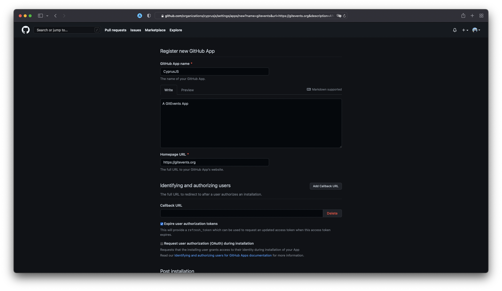
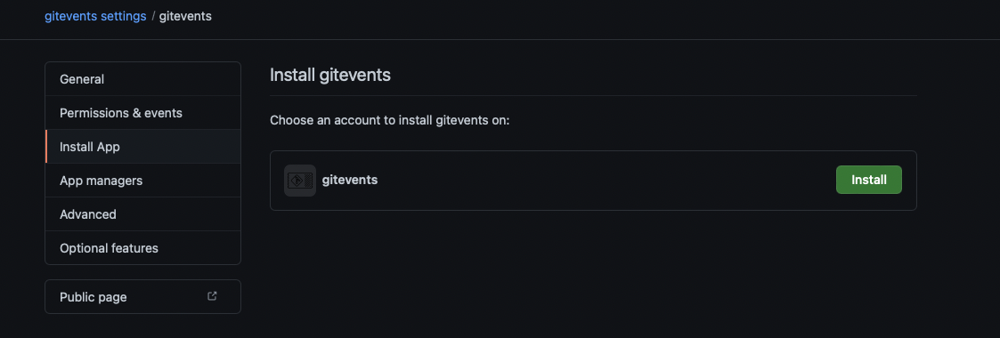
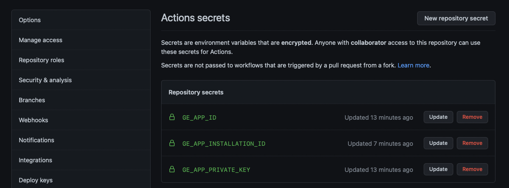
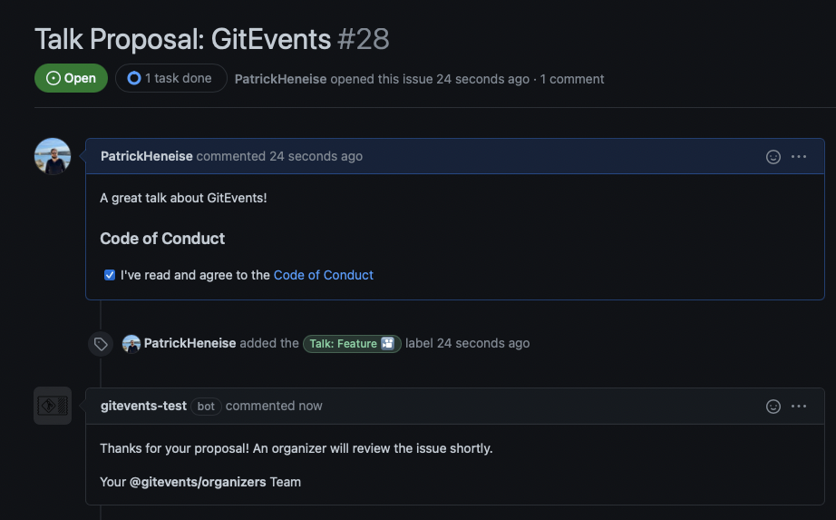

# GitEvents

GitEvents is a GitHub Action that helps your organizers with templates, interacts with your community members and automates typical event-related tasks such as sending tweets and emails.

## Features

### Auto Invite

The basic idea behind "git events" is that every person who interacts with the repo becomes a member of the organization/community. By becoming a member, people get GitHub notifications from your organization, which makes it easier for organizers to reach people and promotes interaction between your community.

### Comments

## Requirements

### GitEvents App

#### The short version

1. Create App
2. Install App for your organization/repo
3. Retrieve App ID
4. Retrieve Private Key
5. Retrieve Installation ID

#### In Detail

All comments, labels etc. will be managed by a GitHub App. You create the App yourself on the Organization account:

[Create GitHub App](https://github.com/organizations/ORGANIZATION/settings/apps/new?name=gitevents&url=https://gitevents.org&description=A%20GitEvents%20App&request_oauth_on_install=false&public=false&issues=write&members=write&metadata=read&pull_requests=write&webhook_active=false)

_Replace ORGANIZATION with your organization name, such as CyprusJS, BarcelonaJS etc._



Follow the link above and you don't need to make any changes except the name. Pick a name, scroll down and create the App. After successful creation, you get to the App Settings screen. Scroll down to the section "Private Key" and create a key (it is downloaded immediately).


Head to the menu entry "Install App" and install the app in your organization.



Copy the App ID (`GE_APP_ID`), the installation ID (from the "Installed GitHub Apps", `GE_APP_INSTALLATION_ID` ) and the private key (`GE_APP_PRIVATE_KEY`) into the repo settings -> "Secrets":



## Installation & Usage

```yml
name: GitEvents

on:
  push:
    branches:
      - main
  pull_request:
  issues:
    types: [opened, edited]

jobs:
  test:
    runs-on: ubuntu-latest
    steps:
      - uses: actions/checkout@v2
      - uses: actions/setup-node@v2.4.1
        with:
          node-version: 12
      - name: gitevents
        uses: gitevents/action@v1.1.0
        with:
          enable-auto-invite: true
          gitevents-app-id: ${{ secrets.GE_APP_ID }}
          gitevents-app-private-key: ${{ secrets.GE_APP_PRIVATE_KEY }}
          gitevents-app-installation-id: ${{ secrets.GE_APP_INSTALLATION_ID }}
```

Create a commit with the message "Enable GitEvents" to run the setup script. This will delete all labels and create GitEvents labels, issue templates etc.

If everything went well, you should receive comments from your GitHub App/Bot:



## License

Licensed under [MIT](./LICENSE).

Here is a list of all the licenses of our [production dependencies](./dist/licenses.txt):
