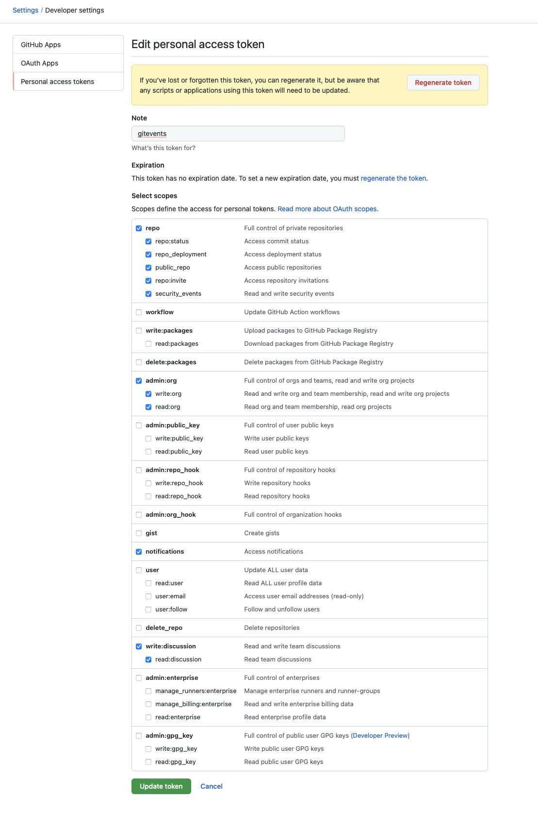

# GitEvents

GitEvents is a GitHub Action that helps your organizers with templates, interacts with your community members and automates typical event-related tasks such as sending tweets and emails.

## Features

### Auto Invite

The basic idea behind "git events" is that every person who interacts with the repo becomes a member of the community. By becoming a member, people get GitHub notifications from your organization, which makes it easier for organizers to reach people and promotes interaction between your community.

### Comments

## Requirements

### GitEvents Bot

In order to comment on issues, add/remove labels or invite community members, GitEvents runs best with a dedicated bot account that only has access to one organization. You should make sure that 2FA and other safety measures are taken to protect this account.

1. Create a [new GitHub account](https://github.com/signup)
2. Create a [Personal Access Token](https://github.com/settings/tokens)
3. Add the account to your organziation. The bot needs `admin:org` access to invite members, and `repo` for access to issues, comments etc.



## Installation & Usage

```yml
name: GitEvents

on:
  push:
    branches:
      - main
  pull_request:
  issues:
    types: [opened, edited]

jobs:
  test:
    runs-on: ubuntu-latest
    steps:
      - uses: actions/checkout@v2
      - uses: actions/setup-node@v2.4.1
        with:
          node-version: 12
      - name: gitevents
        uses: gitevents/action@1.0.0
        with:
          enable-auto-invite: true
          gitevents-bot-login: 'gitevents-b0t'
        env:
          GITHUB_TOKEN: ${{ secrets.GE_ADMIN_TOKEN }}
```

The personal access token from the bot account should be added as `GE_ADMIN_TOKEN` to the repository secrets.

## License

Licensed under [MIT](./LICENSE).

Here is a list of all the licenses of our [production dependencies](./dist/licenses.txt):
